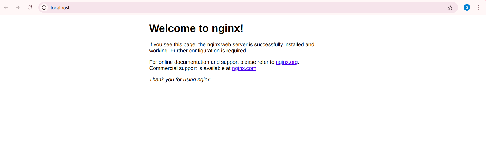

# Elasticsearch-Filebeat-Kibana stack to monitor Nginx logs

## Contents
- Nginx: containing build image nginx web server
- Elasticsearch: containing build image and configuration for Elasticsearch
- Filebeat: containing build image and configuration for Filebeat to stream nginx logs Elasticsearch
- Kibana: containing build image and configure for Kibana to visualize data from an Elasticsearch index

## How it works

- Nginx access and error logs are written to a directory. The directory is mapped to a local volume.
- Filebeat reads the nginx logs from the local volume and sends it to an Elasticsearch index [filebeat-*].
- Kibana uses the index to visualize the access and the error logs.

## How to run it

Pre-requisites
```bash
- docker
- docker-compose
```

To run this stack, run the following command

```bash
docker-compose up -d
```

Accessing the components :

nginx  : `http://localhost`

Kibana : `http://localhost:5601`

Kibana credentials :
- Username: elastic
- Password: changeme%

##Screenshots


nginx port 



kibana port


